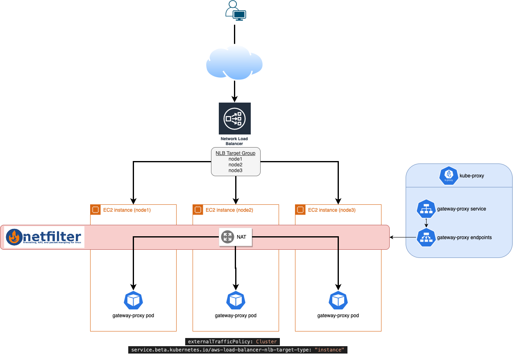
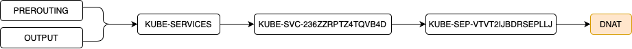
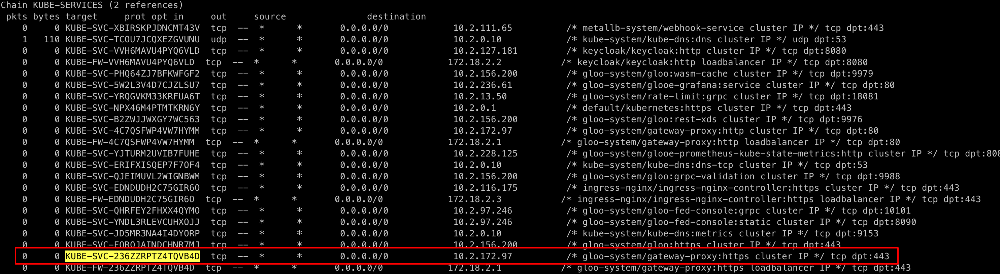
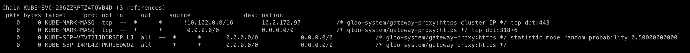
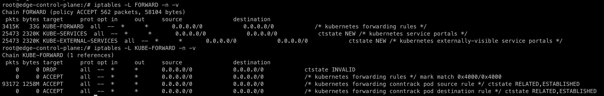

== Zero-downtime on AWS Auto-Scaling group scale-in event with Gloo Edge

For finops and/or environmental purposes, the use of an automatic scale-in/scale-out based on the environment general load is a goal that a lot of companies are trying to reach. If scaling-out is not a problem, scale-in event should be handle correctly to not affect the avaibility of the platform.

Real zero-downtime on scale-in operations can be complicated to achieve depending on the trafic (type or amount) your environement is serving. To help getting zero-downtime and load-balancing, an AWS load-balancer should be used in front of the envoy gateway-proxy of Gloo Edge. Using two reverse-proxy side-by-side in kubernetes is creating differents use-cases you will have to understand if you want a maximal avaibility.

This post tries to describe such an environment and explains what is happenning on an AWS load-balancer scale-in event to help you on avoiding requests losses.


=== Pre-requisites

An important notion to know about is the TCP against HTTP connection. This article is about TCP connections. A single TCP connection can be used to treat multiple HTTP requests. A good TCP connection lifecycle is the base to have a good HTTP connection lifecycle.

In TCP connection, there are different cases to well understand here, making differences on the way connections should be handled to reach high-avaibility :

- _New and established connections_ : a connection can be new or can be already created/used. As describe later in this article, netfilter is able to distinguish new from established connections, both cases have to be differentiated and treated accordingly.

- _Long-lived and short-lived connections_ : a connection will live a certain amount of time depending on what kind of trafic it is created for. For instance, a HTTP(S) call to an API endpoint will be short-lived, a connection to a database would be long-lived connection. When looking to scale-in, long-lived connection would be more complicated not to be closed roughly.

When considering high-avaibility, those notions are really important to understand to be able to apprehend every situations faced with such environment.

=== Solution architecture



==== AWS Load-balancer

AWS provides a load-balancer service (ELB for Elastic Load-Balancer) that helps on avaibility and load-balancing matters.

Different types of load-balancer are proposed to answer different needs :

- *Classic Load-Balancer* (CLB) : the oldest version that is not recommended to be used anymore by AWS ;
- *Gateway Load-Balancer* (GLB) : Layer 3/4 load-balancer, it permits to use third party appliances to route or not the trafic ;
- *Network Load-Balancer* (NLB) : Layer 4 load-balancer so intended to network protocol routing (TCP/UDP) ;
- *Application Load-Balancer* (ALB) : Layer 7 load-balancer so intended to more evoluated routing, based on the content of the request (HTTP/HTTPS) ;

For more details on the comparaison see https://aws.amazon.com/elasticloadbalancing/features/#Product_comparisons

For performance and cost reasons, NLB should probably always be the default choice, and make use of an ALB only when it is needed. Technically, as we are exposing envoy with this ELB, the layer 7 aspect should be totally handle by it. NLB fits our needs.

==== Kube-proxy considerations

When discussing about zero-downtime in kubernetes, some parameters are very important to consider and to understand using this architecture.

===== Annotation service.beta.kubernetes.io/aws-load-balancer-nlb-target-type

The NLB target type is defined by an annotations and it can take 2 values only :

- `instance`: the NLB will route traffic on your service NodePort. In this mode, kube-proxy routing is used. Note that this will not work with AWS Fargate.

- `ip`: the NLB will route traffic directly to the pod IP avoiding the kube-proxy part.

For easier high-avaibility `instance` is probably a better match, especially in coordination with the next paramater `externalTrafficPolicy` set to `Cluster` because it lets kubernetes infers in the routing part, making some avaibility mechanisms to be used. 

The network problematic explained above will be worse if `ip` is used because `kube-proxy` will not be there to route the new trafic to healthy `gateway-proxy` if NLB sends trafic to an unhealthy node. We will dive into this lately in the article.

Using `instance` will make the NLB use what AWS called `target groups`. Healthchecks on NLB are on a per target group basis, meaning that the healthcheck will be done on every target of the group. If a node/target is unhealthy, NLB will stop sending client requests to it.

===== externalTrafficPolicy

`externalTrafficPolicy` will decide if `kube-proxy` will consider a cluster-wide routing or a node-wide/local routing (see link:https://kubernetes.io/docs/concepts/services-networking/service/#aws-nlb-support[here for more details]).

Applied to our case, both have pros/cons :

- `externalTrafficPolicy` to `Local` 

[cols="1,1"]
|=== 
|*Pros*
|*Cons*
|Client's IP address is propagated to the end Pods
|If no service are locally available, the request will fail
|NLB Healthcheck will failed on a terminating node
|Hard kubernetes service scale-in as ELB won't be aware of it
|=== 

- `externalTrafficPolicy` to `Cluster` (kubernetes default mode)

[cols="1,1"]
|=== 
|*Pros*
|*Cons*
|If no service are locally available, the request will be routed to another node
|Client's IP address is not propagated to the end Pods
|Easiest kubernetes service scale-in (not ELB scale-in)
|NLB healthcheck sent to a terminating node could be answered by an healthy node
|=== 

What we can see on those tables is that the NLB healthcheck is actually a problem on both cases :

On the `Local` case, if the gateway-proxy pod is stopped, NLB healthcheck will have to reach the treshhold before getting the node out of the target group, making some requests to fail as kubernetes is not in a cluster-wide mode.

On the `Cluster` case, if an healthcheck reaches a node without the gateway-proxy pod, the request will be routed and answered by an healthy node, making the NLB healthcheck system getting fooled.

As avaibility is the first goal in here, we will try to migate the cons of the `Cluster` mode. 

For the client IP, proxy protocol can be used as it will add the necessary headers to be able to retrieve the IP. NLB has the option and it can be enable using this specific annotation : `service.beta.kubernetes.io/aws-load-balancer-proxy-protocol: '*'`

For the healthcheck answered whereas it should not, as we are using `kube-proxy`, it is not really a problem. The NLB will not be correctly informed of a node failure, but as `kube-proxy` is cluster-wide, it will send the new requests to another kubernetes node and `gateway-proxy` pod. It results that a node is *never* considered as unhealthy in the target groups.

The method is kind of the ELB concept court-circuit in that case, giving some responsabilities to kubernetes in term of pod and service avaibilities.

==== Gloo Edge

Gloo Edge is using link:https://www.envoyproxy.io[envoy] as a reverse-proxy. Envoy is a proxy used to expose cloud-native applications.

Envoy has a link:https://www.envoyproxy.io/docs/envoy/latest/intro/arch_overview/operations/draining[draining mode] that could be triggered by requesting the `/healthcheck/fail` URI (see link:https://www.envoyproxy.io/docs/envoy/latest/operations/admin#operations-admin-interface-healthcheck-fail[envoy documentation for more information]). This ability is usefull when you work on zero downtime cases.

Gloo Edge can be configured to use it and gracefully drain the connections when a pod is terminating.

Using the gloo platform entreprise helm chart with those values :

```yaml
gloo:
  gatewayProxies:
    gatewayProxy:
      podTemplate:
        terminationGracePeriodSeconds: 40
        gracefulShutdown:
          enabled: true
          sleepTimeSeconds: 30  
```

Will add a kubernetes `preStop` hook to the `gateway-proxy` pod like this :

```yaml
lifecycle:
  preStop:
    exec:
      command:
      - /bin/sh
      - -c
      - wget --post-data "" -O /dev/null 127.0.0.1:19000/healthcheck/fail; sleep 30
```

This hook has two good consequences :

- envoy will start failing the healthcheck
- envoy will start draining the connection and make them stop as soon as possible


=== What is happening ?

==== Global overview

When auto scale-in happens, AWS tries first to shutdown the kubernetes node gracefully using ACPI. If the kubernetes nodes is not able to shutdown in a few minutes, AWS will launch a hard shutdown on this instance (see link:https://docs.aws.amazon.com/AWSEC2/latest/UserGuide/Stop_Start.html[]).

When you try to gracefully shutdown a kubernetes node, the node will be cordoned (to avoid new pod scheduling on this node) and tainted (to move hosted pods to a non-terminating node). As you surely know, taint will not work on pods controlled by `ReplicaSet`. As a lot of components in Gloo Edge are using ReplicaSet, the node will not be able to gracefully shutdown most of the time. As a result, the node is hardly killed.

As the NLB is not aware of the node imminent shutdown, the target group will still consider the node as healthy and sends trafic to it. When the node goes (hardly) down, some requests could then be sent to this node, resulting on timeout or errors on the client side.

As the scale-in is an AWS operation, the envoy gracefull shutdown is not launched because the pod is not in a `terminating` state as we can experienced in a kubernetes scale-in (command `scale` or `rollout restart`).

==== More in depth

Kube-proxy is an essential part to understand here. If you do not already know, requests are not going through kube-proxy nor iptables, but throught netfilter (for most/standard cases). Kube-proxy will use iptables to configure netfilter accordingly to your kuberenetes cluster configuration. It is in charge of delivering requests to the "good" pod.

Using two envoy `gateway-proxy`, kube-proxy will configure the NAT chain of netfilter nat table like in this example :







Here are some hints to help understanding :

- The netfilter `PREROUTING` chain is the first applied on all incoming packets to the host ;
- The netfilter `OUTPUT` chain is the first applied on all outgoing trafic from the host ;
- The others chain `KUBE-SERVICES`, `KUBE-SVC-236ZZRPTZ4TQVB4D`, `KUBE-SEP-VTVT2IJBDRSEPLLJ` are custom ones, created and managed by kube-proxy ;
- The target `DNAT` is a Destination Network Address Translation, making netfilter to change the destination IP (and potentially the destination port) on every packets that matches the rule.

There is another important player on the whole chain called `conntrack`. Its role is to track the connections and their states and keep a "database" updated of all connections of the host/system. Netfilter will use conntrack for two main reasons :

- to be able to distinguish new connections from established/related ones
- to be able to identify the response and transform the packet accordingly to send it back to the requester

The first reason is particularly important on long-lived connections. When kube-proxy get a pod out of the kubernetes service `endpoints`, it will delete the `DNAT` rule immediatly to avoid new connections to get to this terminating pod (see link:https://kubernetes.io/docs/concepts/workloads/pods/pod-lifecycle/#pod-termination[]). But what about established connections that has not been closed ?

As conntrack know about those connections, Netfilter will be able to deliver to the same pod the incoming packets and it will still apply (the deleted) DNAT accordingly. The established connections are then still served to the pod even if the pod is out of the endpoints list.

On the filter table, you can see those rules on the `FORWARD` chain :



This means that *new* connections are not delivered to the terminating pod, but *established* ones still are.

In combination with the envoy draining mode when the pod is terminating (kubernetes scale-in), established connection should then be answered correctly. The new connections will be routed to healthy gateway pod(s).

As seen until now, some mechanisms are in place to reach zero-downtime in case of a gracefull node shutdown. However, when ELB scale-in happens, node finished to be hardly shutdown, resulting in packets loss, timeout and/or HTTP errors. The only reason this is happenning is because the NLB is not considering the killed node as unhealthy fast enough.

=== How to avoid the problem ?

There is two possibilities to avoid the problem :

- Help the kubernetes node to taint `ReplicaSet` before it is killed ;
- Ask the NLB to get the node out of the target groups before killing it.

This article will describe the second solutions as AWS provides a good way to do it and because the first one could be a bit harder to implement.

==== Autoscaling-group lifecycle hook

When a NLB scale-in happens, AWS is using their autoscaling-group feature to operate it. If no termination policy is used, ASG is choosing an instance based on some criterias (oldest launch template (or launch configuration) or closest to next billing hour) and it terminates the chosen instance (see link:https://docs.aws.amazon.com/autoscaling/ec2/userguide/as-instance-termination.html[this link for more info]).

The main problem is that AWS will not get a node out of a target group before killing the instance.

Before terminating, the instance will first go throught `Terminating:Wait` state that could be used to launch some work using others AWS services like lambda (see link:https://docs.aws.amazon.com/autoscaling/ec2/userguide/lifecycle-hooks-overview.html[how lifecycle hooks work]).

Using this ability, it is then possible to get the node out of the target group, and also use it to drain the connections before doing so.

When the Lambda function gets the node out of the ELB, new connections will not be sent to the node but established ones will. It will assure that no connections are still established when the node got out of the target group.

Each environment should be considered different and NLB deregistration delay is important to be set to the environement needs as it should cover the long-lived connection time :

[source,yaml]
service.beta.kubernetes.io/aws-load-balancer-target-group-attributes: "deregistration_delay.connection_termination.enabled=true,deregistration_delay.timeout_seconds=30"

==== Deregister before killing the node

This is an example of what could be done to maximize the avaibility : link:https://github.com/Ati59/amazon-asg-instance-deregister[Deregister instance lifecycle hook]

It uses python and the AWS Serverless Application Model (an AWS cli that uses CloudFormation under the hood) to deploy a Lambda function and attach it to the NLB specified, using the lifecycle hook feature.

When an autoscaling group scale-in happens, a lambda function will be executed to deregister the node safely before the node get to the terminating state.

During the deregistration period, the NLB will not send any new connections to gateways, only the established ones will be forwarded. Once those connections ended up, no more trafic will get to the gateways, the instance hard stop is then no more a problem, maximizing avaibility and reaching a zero-downtime on NLB scale-in with Gloo Edge.
